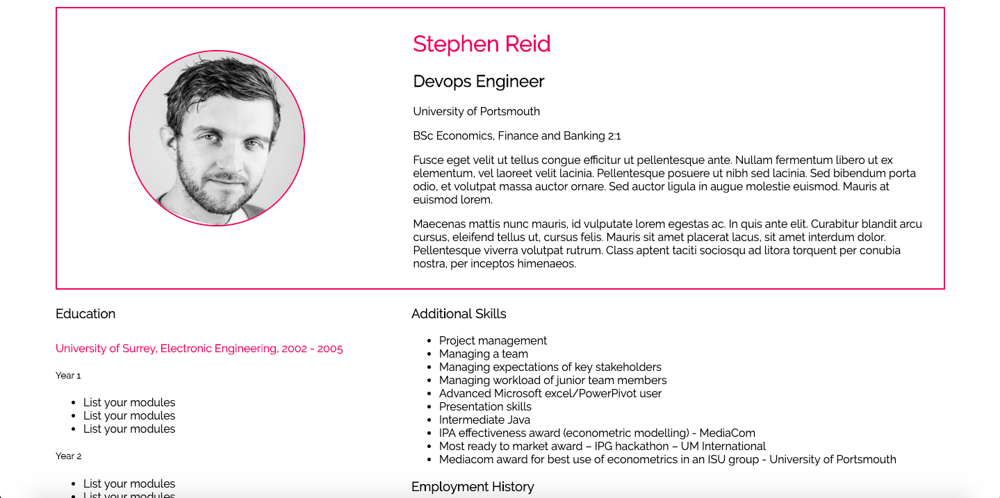
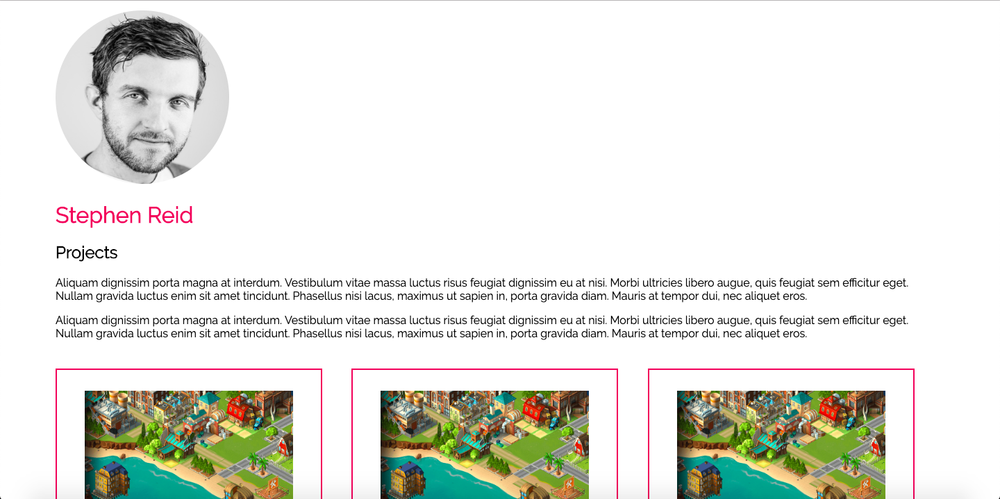
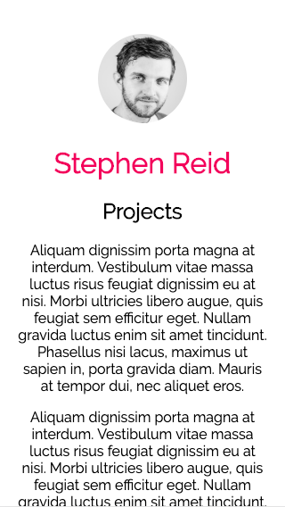

# CSS Media Queries Lab

## Summary

The task was to use CSS media queries to make the website aesthetically pleasing at all screen widths and devices. Starting from an unresponsive CSS layout of Steve's profile, the task was to ensure that the page had at least two noticeably different layouts at different screen widths.

 ## Information

 To see this site, download and clone this repo.

### Original layout- Homepage

### Original layout- Projects Page

### Responsive layout- Homepage

### Responsive layout- Projects Page

